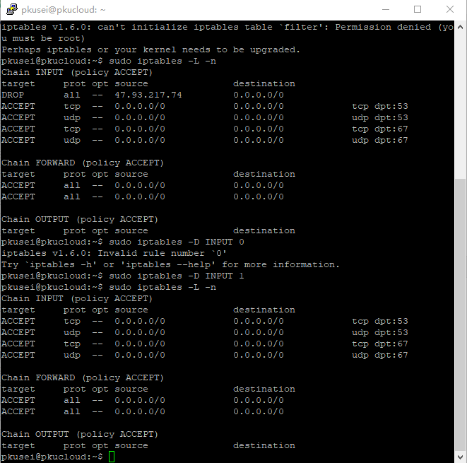
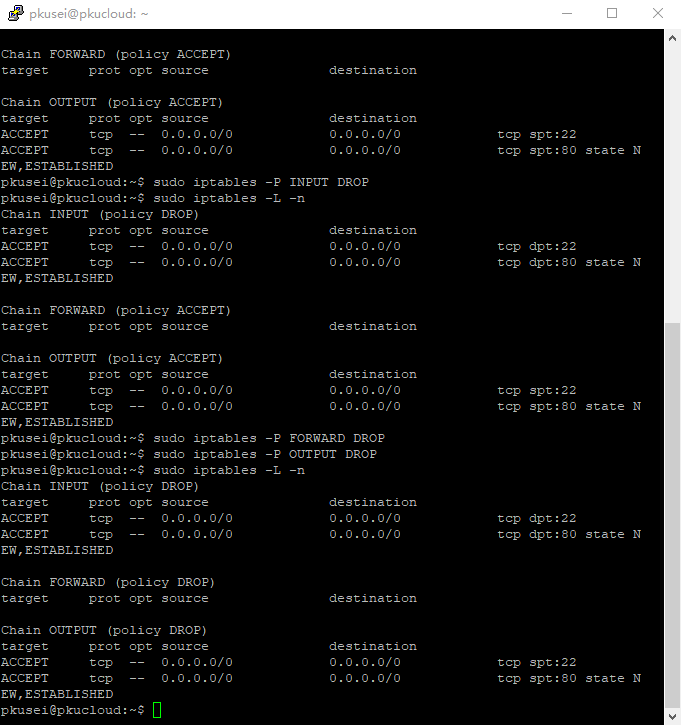
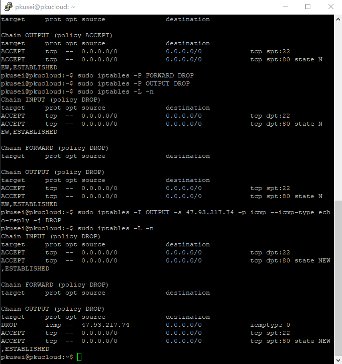
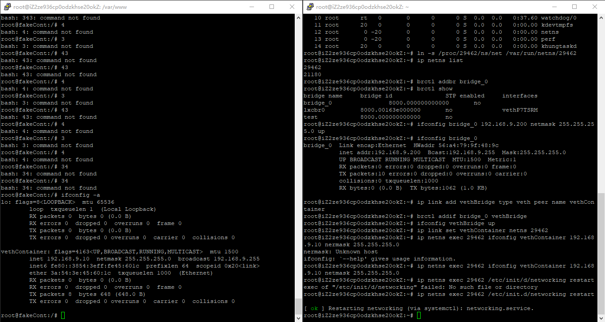
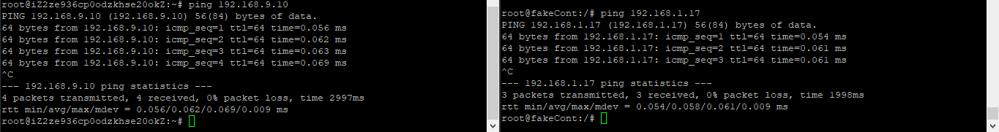
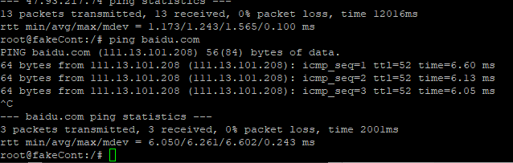
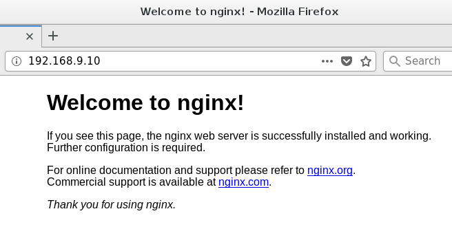
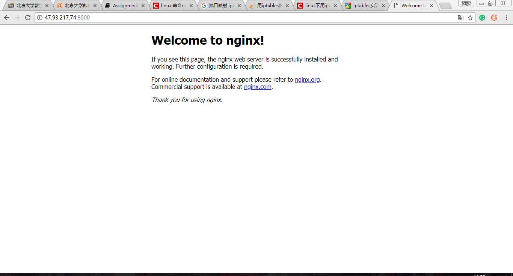

# 第三次作业

### 叙述linux网络包处理流程

考虑本机收到的网络包, 它会经过 PREROUTING, INPUT链

本机发出去的包会经过 OUTPUT, POSTROUTING链

被本机转发的包会经过 PREROUTING, FORWARD, POSTROUTING链

其中PREROUTING链包括这些流程
 - raw: 在最开始丢掉包或者直接放行, 或者让包走用户定义的链
 - connection tracking: 检查这个包的状态: 比如说是之前某一个连接的包, 还是属于一个新的连接的包, 也会比对这个包是否经过nat转换
 - mangle: 对包进行可能的修改, 比如修改包头的数据(TTL之类的)
 - nat: 进行目的地址的修改(DNAT), 随后决定路由的方向

INPUT链包括这些流程
 - mangle: 同上, 进行必要的修改
 - filter: 查filter table过滤掉一些包

FORWARD链包括这些流程
 - mangle: 同上
 - filter: 也是和上面一样

OUTPUT链包括这些流程
 - raw, connection tracking: 检查, 记录包的状态
 - mangle: 还是同上
 - nat: 这里是DNAT, 转换目的地址, 随后决定路由的方向
 - filter: 还是同上

POSTROUTING链包括这些流程
 - mamgle: 还是一样的
 - nat: 这里是SNAT, 转换源地址, 随后决定路由的方向

###### 参考

 [解释connection tracking的一个网站](http://wiki.netfilter.org/pablo/docs/login.pdf)

 [讲义原图的网站](https://www.booleanworld.com/depth-guide-iptables-linux-firewall/)

 [比较详细解释过程的图片](https://mikrotik.com/testdocs/ros/2.9/img/packet_flow31.jpg)


### 使用iptables实现一些功能

##### 拒绝ip访问

```shell
iptables -I INPUT -s xxx.yyy.zzz.www -j DROP
```



##### 只开放http, ssh, 拒绝其他端口, 服务

```shell
iptables -p INPUT DROP
iptables -p OUTPUT DROP
iptables -p FORWARD DROP

# ssh
iptables -A INPUT -p tcp –dport 22 -j ACCEPT
iptables -A OUTPUT -p tcp –dport 22 -j ACCEPT

# http
iptables -A INPUT -p tcp –dport 80 -j ACCEPT
iptables -A OUTPUT -p tcp –dport 80 -j ACCEPT
```



##### 拒绝回应一个ip的ping

```shell
iptables -I OUTPUT -s xxx.yyy.zzz.www -p icmp --icmp-type echo-reply -j DROP
```




### 解释区别, 工作原理

##### 路由和交换的区别

__路由__

在第三层工作, 利用ip地址, 处理数据包

路由会根据路由表(手动添加的或者动态生成的), 找得到目的地址(_或者它的最大匹配前缀?_)就从对应的端口发出去, 找不到就从默认路由发出去, 没有默认路由就返回不可达.

__交换__

在第二层工作, 利用MAC地址, 处理数据帧

交换机会学习源地址的MAC, 存储在MAC表里面, 转发的时候, 找得到目的地址就从对应的端口转发出去, 没有就从所有端口发出去.

##### 介绍bridge veth的工作原理

__bridge__

bridge可以看作是用软件实现的一种交换机, 有多个端口, 控制面, 转发面和一个MAC学习数据库, 转发的过程中, 如果发现数据库中有相应的条目, 就从相应的端口转发出去, 没有就从所有端口发出去.

创建bridge的过程, 会初始化相应的数据结构, 包括它连接的设备, 端口链表, 转发表. 向bridge添加设备的过程中, 会增加一个端口对象, 网桥承接它的所有流量, 把它加入转发表(默认它会收到网桥上的所有流量). 网桥收到帧时, 更新转发表(用这个帧的源MAC地址), 再寻找转发目的端口, 如果找到了, 就只从这个端口发出去, 没有或者目的地址是广播地址, 就从所有端口发出去

###### [一篇介绍网桥的论文](https://wiki.aalto.fi/download/attachments/70789083/linux_bridging_final.pdf)

__veth__

一个总是成对的设备, 其中一端收到的数据会转发到另一端(应该不会出现冲突的情况, 在veth_xmit()函数中, 发数据之前先去拿了锁). 成对的veth总是同时开启, 或者同时关闭.

###### [一些有关veth的源码](https://github.com/torvalds/linux/blob/master/drivers/net/veth.c)

### 改进fakeContainer

其中使用的[命令](./src/script.sh)

##### 实现课件上的网络结构

```shell
# 主机内

# pid为容器的pid
ln -s /proc/$pid/ns/net /var/run/netns/$pid

brtcl addbr bridge_0

ifconfig bridge_0 $bridge netmask 255.255.255.0 up

ip link add vethB type veth peer vethC

brctl addif bridge_0 vethB

ifconfig vethB up

ip link set vethC netns $pid

ip netns $pid exec ifconfig vethC $container netmask 255.255.255.0

# 至此, 网络结构应该是建立完毕了

# 容器内

ip route add default dev eth0

```



设置路由之后, 主机和容器互相能ping通




###### 参考

[容器分配静态ip](https://www.cnblogs.com/mosmith/p/5372326.html)

[添加网卡的参考](https://cloud.tencent.com/developer/article/1044329)

##### 能够访问internet

```shell
# 主机上

iptables -t nat -A POSTROUTING -s $container -j SNAT --to $host

# 容器内

route add default gw $host dev vethC
```

测试结果



##### 部署nginx服务器

```shell
# 主机内

iptables -t nat -A PREROUTING -p tcp --dport $port -j DNAT --to-destination $container:80

iptables -t nat -A POSTROUTING -d $container -p tcp --dport 80 -j --to $host
```

开启nginx, 主机上可以访问容器的网页



设置端口映射, 外网可以访问容器内的网页



##### 说明网络包的流程

网络包通过物理网卡, 进入宿主机的协议栈

首先触发NF_IP_PRE_ROUTING, 进入PREROUTING链, 先后比对raw, mangle, nat(DNAT)表的内容

不妨假设这是一个新来的包, 那么在connection tracking之后, 这一个新的连接被标记为NEW(应该还不是DNAT, 这里还没有转换地址)

mangle中应该没有做相关的变动

nat中, 网络包的目的地址被变动

先后触发NF_IP_FORWARD, NF_IP_POST_ROUTING, 经FORWARD, OUTPUT链走出主机的协议栈, 经网桥转发到容器的虚拟网卡, 期间没有经过改动

进入容器的协议栈, 经过PREROUTING, INPUT链, 被监听80端口的nginx收到, nginx发出回复的网络包, 经OUTPUT, POSTROUTING走出容器的协议栈, 因为网关设置为主机的ip, 所以这一个包会到达主机.

同样的经过PREROUTING, 并不是发给自己(主机)的包, 进入转发链, 进入POSTROUTING链, nat(SNAT中把源地址转回成主机)

###### 没有解决(?)的问题

一些资料没有提到connect tracking, 而是认为connect tracking的工作是由raw完成的, 怀疑是出于简化的目的, 并且/net/ipv4/netfilter/iptable_raw.c中也没有提到这些内容.

[这里的图片再看看](https://wiki.mikrotik.com/wiki/Manual:Packet_Flow)

###### 2018-04-09
