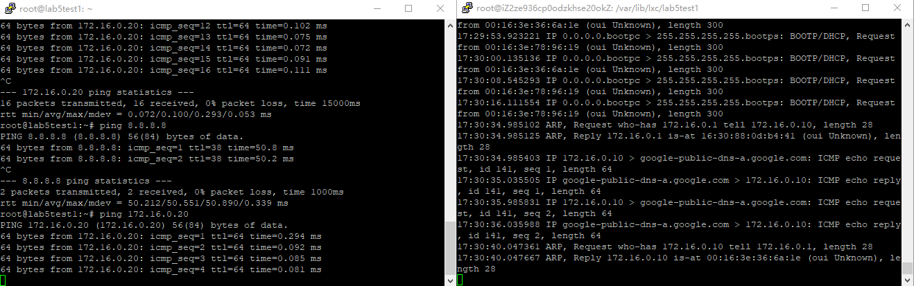
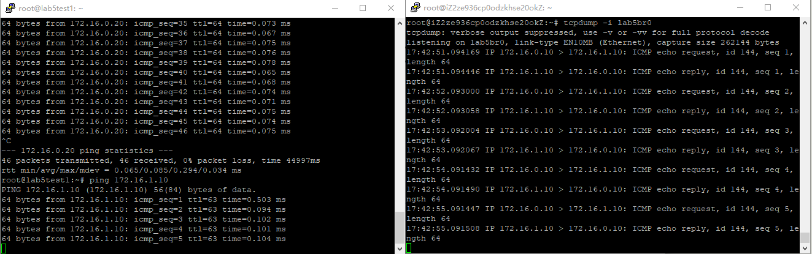
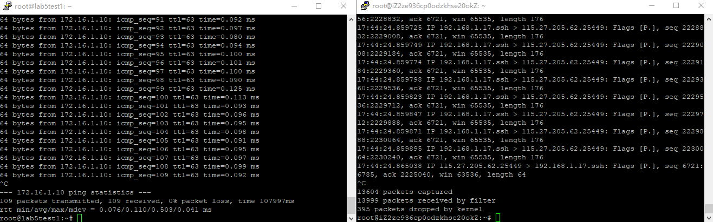
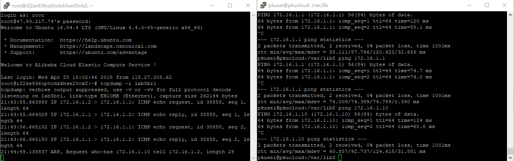

# 第四次作业

### 叙述以下的容器通信的处理

#### 同一子网的不同容器

下面分别是ping同一子网容器和ping外网的结果, 可以看到arp(?)

#### 同一host不同子网的两容器

下面是ping不同子网容器的结果(container1 - bridge0 - bridge1 - container2)

分别监听br0, br1, host的eth0

#### gre隧道相连的两host上的两容器

下面是实验的结果, 原来ovs上可以搭的啊...不用自己设的啊...

