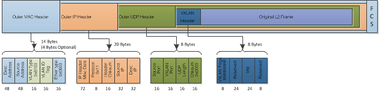
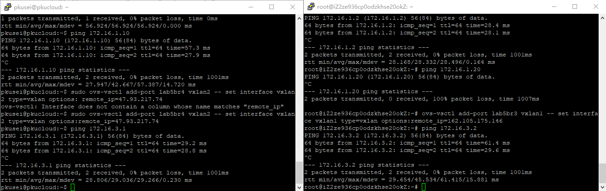
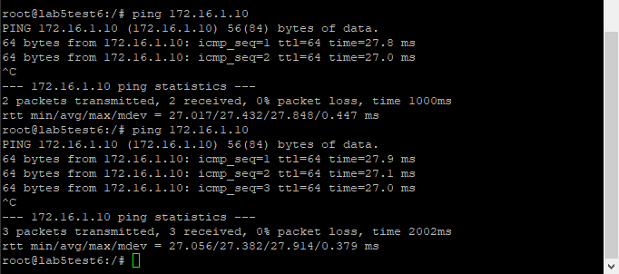
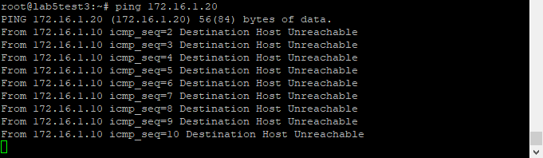
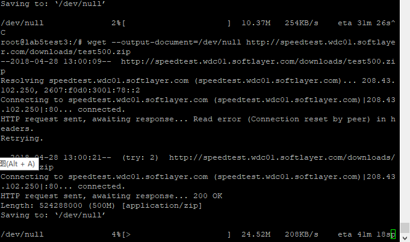
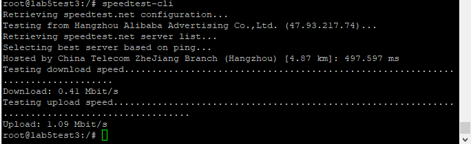

# 第四次作业

### 叙述以下的容器通信的处理

#### 同一子网的不同容器

因为处于同一子网, 容器发送arp, 寻找目的地址, 之后直接向目的地址发送数据

下面分别是ping同一子网容器和ping外网的结果, 在访问外网的过程中可以看到可以看到容器寻找网关的arp


#### 同一host不同子网的两容器

在网关不相通的情况下, 包在走出容器1时加上tag, 但并因为tag不同, 不会走进另一个容器的port, 所以不相通


#### gre隧道相连的两host上的两容器

包在走出容器1的port时加上tag, 经过gre隧道再加上[remote_ip][local_ip], 从host1网卡走出去的包类似[dmac][smac][remote_ip][local_ip][tag][data]

到达host2, 网卡, gre, port分别解掉对应的包头, 因为tag相同, 可以通过容器2的port

下面是实验的结果


### 叙述vlan, 解释用户数量限制

vlan是通过在数据包上添加包头来识别不同的子网, 共4字节, 其中12位用来标注VID, 0x000和0xFFF是保留的, 所以最多可以有4094个子网

交换机的各个端口上设有标签. 当接到一个需要转发的帧的时候, 交换机加上这个端口对应的标签, 只转发到标签相同的端口上面, 同时把标签去掉, 但如果是trunk转发到另一个交换机的话, 不会去掉标签, 由对端的交换机负责去标签

### 调研vxlan, 和gre比较

vxlan的包头有8字节, 用24位标识子网序号, 所以相比于vlan能够容纳更多的子网



gre采用GRE协议, 而vxlan借助了UDP传输协议, 这也使得vxlan的网络包相对大一些

gre, 更多的是一个三层的协议, 封装似乎并不直接支持802.1Q

vxlan主要工作在二层, 可以看作802.1Q的拓展

在ovs上部署方式和gre类似



### 实现网络结构, 体显隔离性和相通性

使用到的脚本类似[src/shell.sh](./src/shell.sh)

下面分别是同组和不同组的容器ping的结果





### 限制流量

一种方法可以是

```
ovs-vsctl set Interface eth0 options:link_speed=200K
```

结果如下图, 上面的是限速之前, 下面的是限速之后, 网速大致在200K上下徘徊, 限制的并不紧, 而在speedtest-cli测速中完全失效



另一种方法是

```
ovs-vsctl -- set port lab5br1 qos=@newqos \
-- --id=@newqos create qos type=linux-htb other-config:max-rate=1000000 queues=0=@q0 \
-- --id=@q0 create queue other-config:min-rate=100000 other-config:max-rate=1000000
```

通过了speedtest-cli测试, 限制也不是很紧(或许是误差的因素)




###### 用于实验的网络结构

```java
host1{
    lab5br0{ // 同一子网容器访问
        lab5test1
        lab5test2
    }
    lab5br1{ // 实现课上网络结构
        lab5test3
        lab5test4
    }
    lab5br3{ // 测试vxlan

    }
}

host2{
    lab5br2{ // 课上网络结构, test6和test4属于同一子网
        lab5test6
    }
    lab5br4{ // 测试vxlan

    }
}
```
