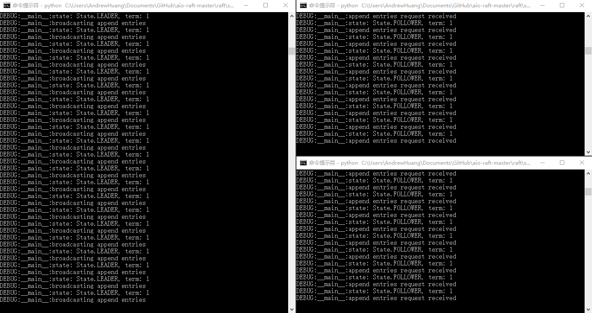
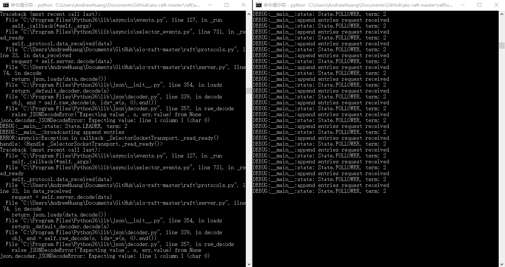
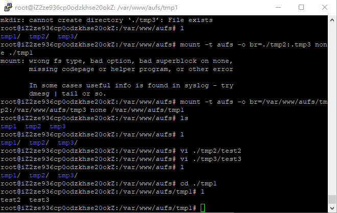
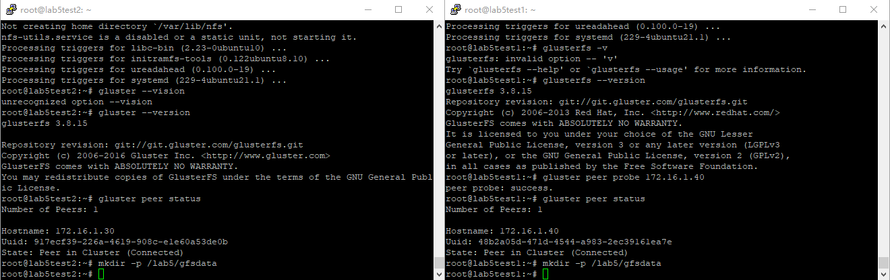
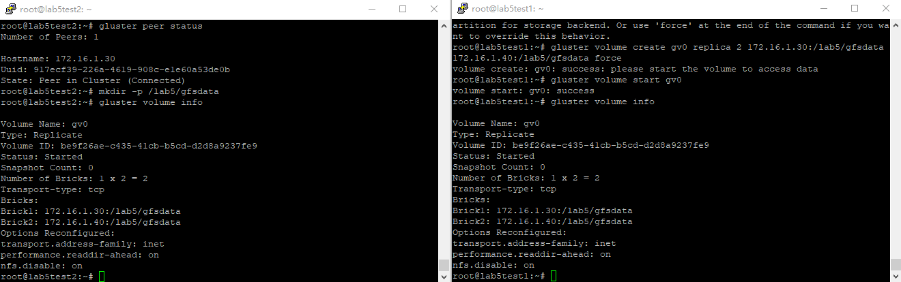
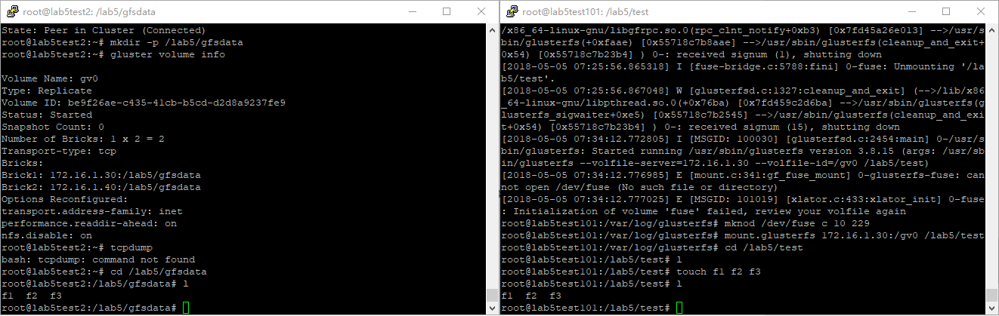
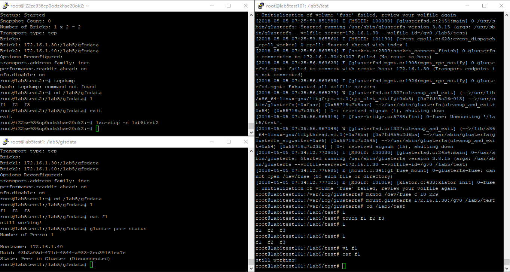
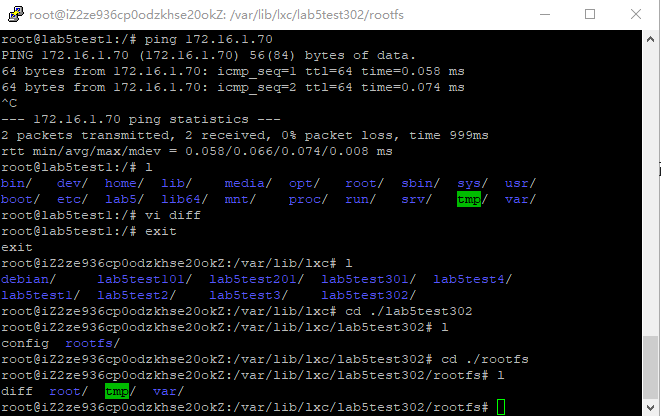
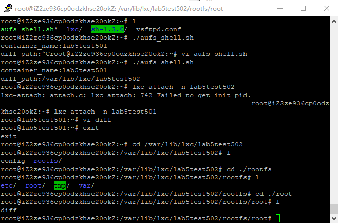

# 第五次作业

### 模拟raft, 叙述处理过程

#### 模拟过程

使用这个[开源项目](https://github.com/guilload/aio-raft/tree/master/raft)模拟raft工作场景

开启三个服务器, 分别监听10000, 10001, 10002端口, 经过投票, 选出一个leader



关掉LEADER, 剩余的两台服务器另选出一个LEADER(图中出错信息为试图联系原LEADER时的错误信息)



to-do: 能否显示数据的同步? 模拟合并的情形?

#### 叙述raft处理过程

##### 选举leader

所有节点最开始初始化成follower, 等待自己一段时间内联系不到leader(不同节点这个时长不同)之后成为candidate

成为candidate的节点向其他节点拉票, 得到一半以上票数的节点成为唯一的leader, 定时向其他节点发出心跳, 保持联系.

##### 日志同步

client只和leader通信, 提出修改(具体实现上, 可以把其他节点重定向到leader)

client发出一个修改, 接到leader的日志的尾部, leader向所有节点广播这一个修改, 收到半数以上的回复之后, 确认修改, 返回给client

##### fatal error?

咕咕咕

### 调研GlusterFS和AUFS文件系统

#### GlusterFS

GlusterFS是在用户空间工作的软件.

各台机器之间通过TCP/IP或者infiniband之类的协议通讯, 集群之中各台机器都存有数据的一个备份, 当然如果任一个节点发生变化也要同步到所有其他的节点


用户修改文件通过mount point(也就是说处理的过程中可以当作gluster不存在), 随后交给本机的vfs, fuse, /dev/fuse, 之后交给本机的gluster client, 最终通过网络和server通讯


文件名通过hash函数得到hash值, 来决定存储在哪一个brick中, 使得定位文件是比较快的(但是遍历文件(ls)会慢一点), hash函数按brick的个数平均分配(如果加入新的节点, 那么之前的文件尽量不动, 新的文件加入新的节点中, 也可以通过rebanlance平均分配)

文件的存储模式有下面几种
 - distributed volume, 文件通过上述的hash函数分配到不同的brick上, 没有备份
 - stripe volume, 文件分成几份发到不同的server上, 传输的粒度小(并发?)
 - replicated volume, 文件复制几份存储在所有brick上(复制的份数要是brick的倍数), 数据是可靠的, 在读数据时检查server之间的一致性, 写数据时先锁住一台服务器, 之后同步修改
 - stripe replicated volume, 文件分几份, 每一份备份在几个服务器上
 - distributed * volume, 上述二三四种模式可以分布式进行, 譬如说文件分几份只发到一部分服务器上

###### to-do

试一试各种卷

#### aufs

先看看[这个](https://www.thegeekstuff.com/2013/05/linux-aufs/), 好像挺有用的

简单的实验



###### ref

[Gluster的一篇简介](http://moo.nac.uci.edu/~hjm/fs/An_Introduction_To_Gluster_ArchitectureV7_110708.pdf)

[Gluster卷的介绍](http://blog.51cto.com/linuxnote/1825665)

[sfjro/aufs4-linux](https://github.com/sfjro/aufs4-linux) 752k次提交....

### 安装配置GlusterFS, 挂载到lxc容器中

安装glusterfs(ubuntu)

```shell
add-apt-repository ppa:gluster/glusterfs-3.8
apt-get update
apt-get install glusterfs-server
apt-get install glusterfs-client
```

添加两台服务器, 建立用于备份的文件夹



在一台上建立卷, 另一台上也能看到卷的内容



安装客户端, 创建文件, 服务器上也能看见



写内容到文件里, 挂掉一台服务器, 文件内容还在



###### 用于测试的网络结构

```c
host{
    lab5br0(172.16.1.1){
        // server
        lab5test1(172.16.1.30)
        lab5test2(172.16.1.40)

        // client
        lab5test101(172.16.1.50)
    }
}
```

###### 参考资料

[没有fuse的解决方法](https://www.claudiokuenzler.com/blog/501/mount-glusterfs-volume-lxc-container-dev-fuse-no-such-file#.Wu1eqoiFPIU)

### 为lxc提供镜像服务

#### 手动模拟

首先将现有的一个容器拷贝到另一个不同名文件夹, 修改config的内容(包括容器名称, ip地址, veth对端名称), 发现就可以安装一个新的容器了

所以我们接下来要实现的就是
 - 使用aufs构建镜像而不是完全拷贝所有文件
 - 用脚本模拟手动修改config的过程

#### aufs构建镜像

```shell
mount -t aufs -o br=${diff}=rw:${HOME}=ro none /var/lxc/${cont_name}
```

用已知的一个容器做为共享的文件, 把新的容器修改的部分存放到diff文件夹下, 经测试也是可行的



###### 用lab5test302作为修改了的文件夹, 发现容器正常工作, 也成功记录了修改的内容

#### shell脚本

暂时的脚本在[这里](./src/aufs_shell.sh)

测试的结果



######

###### to-do

如果第一次安装容器怎么办?

diff文件夹统一放到别的地方, 否则lxc-ls会看见它们
