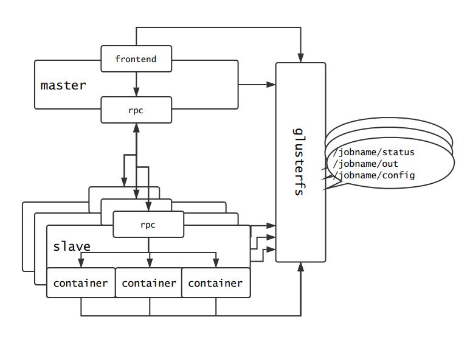
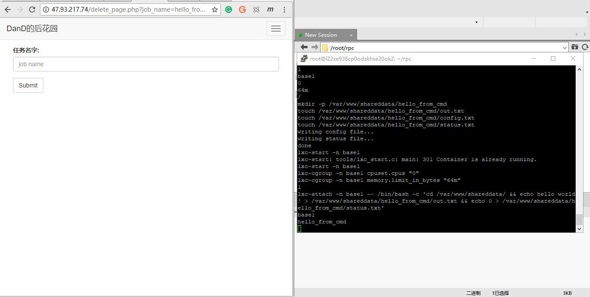
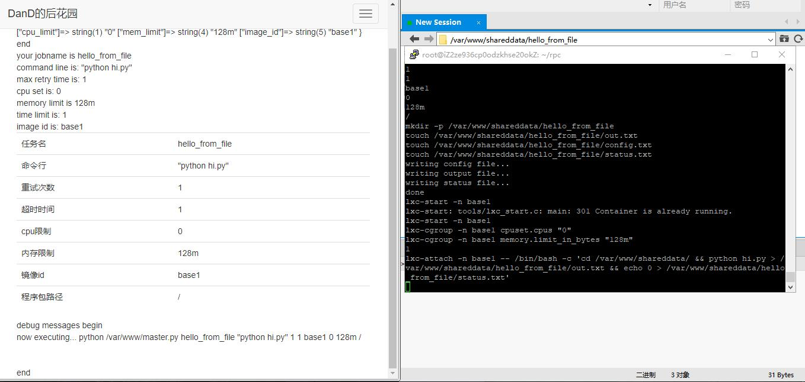
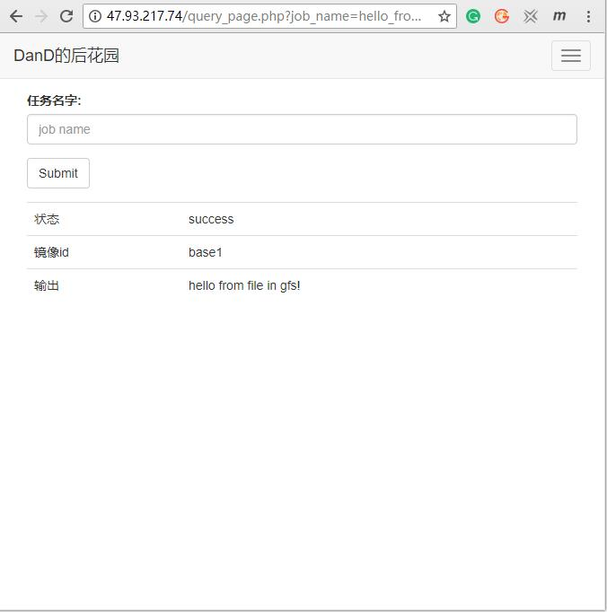
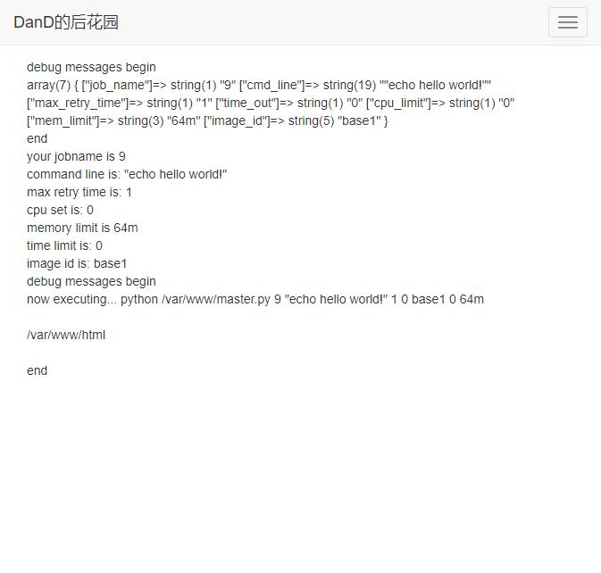
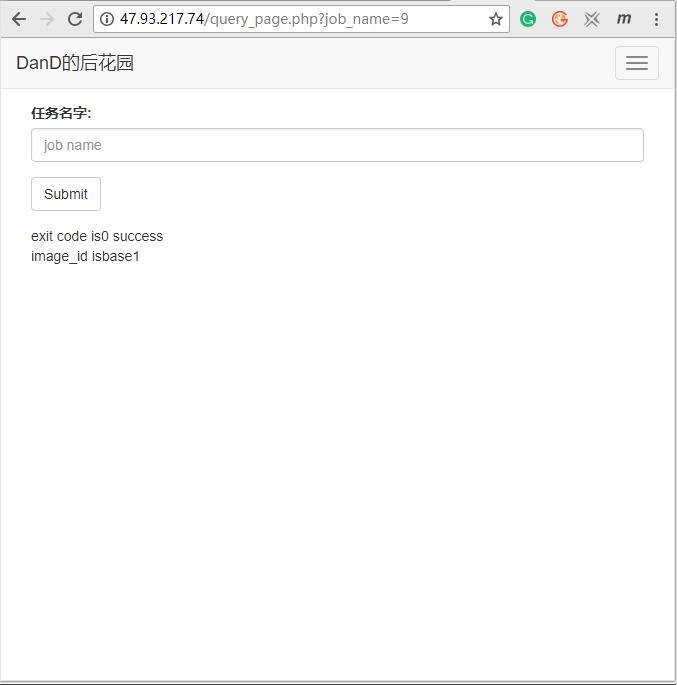

# 第六次作业

### 已实现的功能

- 用户自定义输入
    - 执行任务的命令行
    - 设定超时时间
    - 失败重试次数
    - 输出文件重定向
- 可视化
    - 设计提交界面, 用户通过填写表格提交任务
    - 设计查询界面, 用户填写任务名称查询状态
- 任务管理
    - 通过维护状态文件, 查询管理任务状态
    - 后台查看调用情况

### 现行架构

用户同前端交互, 提交任务后, [php文件](./src/backend/action_page.php)执行[master进程](./src/backend/master/master.py), 通过rpc方式, 将任务分发给slave节点上的[deamon进程](./src/backend/slave/slave.py), 执行任务.

全过程中维护gfs上的/shareddata/job_name/status.txt, /shareddata/job_name/config.txt, 并将输出重定向至/shareddata/job_name/out.txt

任务状态暂时通过读取/shareddata/job_name/status.txt实现, 初始化为-1, 表示还在pending, 退出码0为成功, 其他值表示失败



### 实验结果

创建任务: 输出hello world


创建成功的返回值


查询状态


删除任务, 和后台的log



创建任务: 运行用户的文件



查询状态



### 评测

- 性能主要的瓶颈在通信层面上, 无论是glusterfs还是rpc都会有一定的延迟, 不能对通讯时间有假设.
- 为节约执行任务时间, 暂时不会主动关闭容器(因重启和重启之后的配置耗时比较长), 此后可能需要根据具体的使用场景分析, 如果需要关闭容器的话, 需要
    - 在用户需要删除的时候关闭容器
    - 在启动任务的时候重新搭建glusterfs
- 出于管理方便, 容器理应是临时构造的镜像(比如使用lab5的脚本), 但这一台机器上aufs还不能用, 实现上只有有限台容器(但这样调用速度会加快, 需要取舍)
- 目前master和slave在同一台物理机上, 但如果迁移开也只需要改动ip地址就好
- 判断是否成功调用/是否超时, 暂时不根据任务是否执行完成, 同样需要考虑执行长任务的问题
- 如果需要拓展到有多个节点, 可以考虑考虑把任务优先调配到负载最小的节点; 或者round-robin调度(这样节省流量, 和通信上的时间)

### 具体实现

#### 用户交互

[用户界面](http://47.93.217.74/oslab.html)

用户通过填写表格, 自定义任务


提交任务后, 跳转到提交界面(旧的界面)



[查询任务界面](http://47.93.217.74/status_query.html)

输入任务id, 跳转到结果界面



[删除任务](http://47.93.217.74/delete.html)


#### master节点上的实现

用户的操作都经由www-data(apache用户)代为执行

提交任务的代码

```php
// php

<?php
echo "now executing... python /var/www/master.py $job_name $cmd_line $max_retry_time $time_out $image_id $cpu_limit $mem_limit";

echo "<br>";

echo `python /var/www/master.py $job_name $cmd_line $max_retry_time $time_out $image_id $cpu_limit $mem_limit`;

echo "<br>";

?>
```

```python
# python

client = msgpackrpc.Client(msgpackrpc.Address("localhost", 8080))
client.call('run', sys.argv[1], sys.argv[2], sys.argv[3], sys.argv[4], sys.argv[5], sys.argv[6], sys.argv[7]);
```

query_page的实现如下(log文件权限755, 可以读不能写)

```php
// php

<?php
    $job_name = $_GET['job_name'];
    $job_path = '/var/www/shareddata/'.$job_name;
    if(is_dir($job_path)){
        $flie_name = '/var/www/shareddata/'.$job_name.'/status.txt';
        if(file_exists($flie_name)){
            $file_handle_code = fopen($flie_name, 'r');
            fscanf($file_handle_code, '%d\n', $status);
            echo 'exit code is';
            echo $status;
            echo '    ';
            if($status === 0){
                // 用户返回了0
                echo 'success';
            }else if($status === -1){
                // 用户没有返回零, 或者调用失败没有覆盖初始化的1
                echo 'unknown';
            }else{
                echo 'failed';
            }
            fclose($flie_name);
        }else{
            // 还没创建文件
            echo 'pending';
        }
        echo '<br>';
        $flie_name = '/var/www/shareddata/'.$job_name.'/config.txt';
        $file_handle_image = fopen($flie_name, 'r');
        $image_id = fgets($file_handle_image, 1024);
        echo 'image_id is';
        echo $image_id;
    }else{
        echo 'can not find its directory...';
    }
?>
```

#### slave节点的实现

slave端运行rpc的server准备接受调度到它的任务

```python
# python

# lxc 在本机不能用, 暂时通过shell实现

os.system("mkdir -p /var/www/shareddata/%s" % jobname);
print("mkdir -p /var/www/shareddata/%s" % jobname);

os.system("touch /var/www/shareddata/%s/out.txt" % jobname);
os.system("touch /var/www/shareddata/%s/config.txt" % jobname);
os.system("touch /var/www/shareddata/%s/status.txt" % jobname);

print("touch /var/www/shareddata/%s/out.txt" % jobname);
print("touch /var/www/shareddata/%s/config.txt" % jobname);
print("touch /var/www/shareddata/%s/status.txt" % jobname);

with open("/var/www/shareddata/%s/config.txt" % jobname, "w") as fp:
    print("writing config file...");
    fp.write(image_id);

with open("/var/www/shareddata/%s/out.txt" % jobname, "w") as fp:
    print("writing output file...");
    fp.write("something must be wrong if you see this!");

with open("/var/www/shareddata/%s/status.txt" % jobname, "w") as fp:
    print("writing status file...");
    fp.write("-1");
    print("done");
    time.sleep(1);

print("lxc-start -n %s" % image_id);
os.system("lxc-start -n %s" % image_id);
print("lxc-start -n %s" % image_id);

os.system("lxc-cgroup -n %s cpuset.cpus \"%s\" " % (image_id, cpu_limit) );
os.system("lxc-cgroup -n %s memory.limit_in_bytes \"%s\" " % (image_id, mem_limit) );
print("lxc-cgroup -n %s cpuset.cpus \"%s\" " % (image_id, cpu_limit) );
print("lxc-cgroup -n %s memory.limit_in_bytes \"%s\" " % (image_id, mem_limit) );

print(max_retry_time);
if max_retry_time > 0:
    now_try_time = 0;
    while now_try_time < max_retry_time:
        now_try_time += 1;
        print("lxc-attach -n %s -- /bin/bash -c 'cd /var/www/shareddata%s && %s > /var/www/shareddata/%s/out.txt && echo 0 > /var/www/shareddata/%s/status.txt' " % (image_id, path_to_file, cmd_line, jobname, jobname) );
        os.system("lxc-attach -n %s -- /bin/bash -c 'cd /var/www/shareddata%s && %s > /var/www/shareddata/%s/out.txt && echo 0 > /var/www/shareddata/%s/status.txt' " % (image_id, path_to_file, cmd_line, jobname, jobname) );

        time.sleep(time_out);

        with open("/var/www/shareddata/%s/status.txt" % jobname, "r") as fp:
            status_now = fp.read();
            if status_now == 0:
                break;
return 0;
```

删除任务暂时只是删除任务的文件(总假定运行的是短任务, 为下一次运行节省启动容器的时间)

```python
with open("/var/www/shareddata/%s/config.txt" % job_name, "r") as fp:
    image_id = fp.read();
print(image_id);
print(job_name);
os.system("rm -rf /var/www/shareddata/%s" %job_name); # am i right...? a 'rm -rf' here!

```

#### 坑

- 没有fuse起不了glusterfs? mknod /dev/fuse c 10 229
- lxc-attach不能用cd? /bin/bash -c ''
- iptables用-A添加的规则用-D原封不动删掉
- 部分实验的结果在timeline.md中
